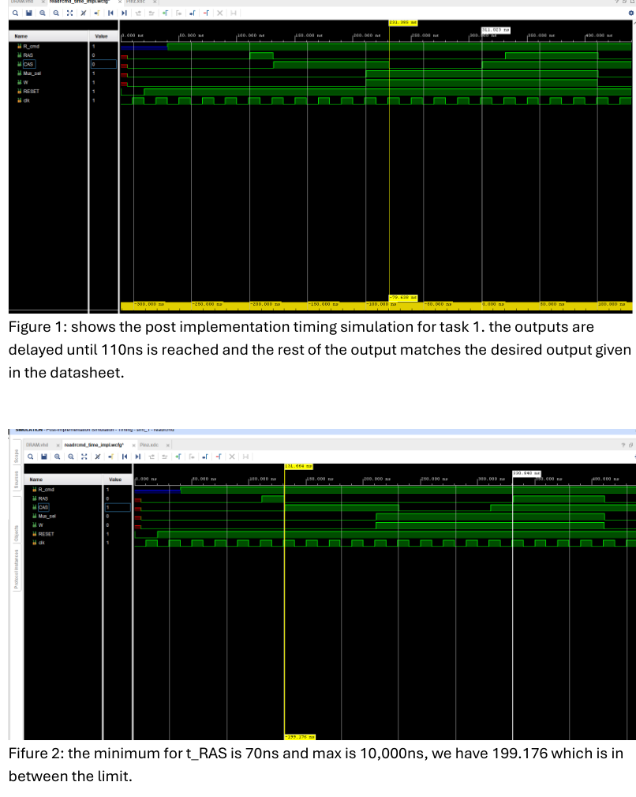
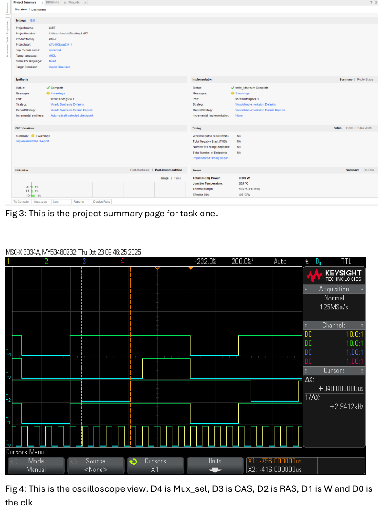
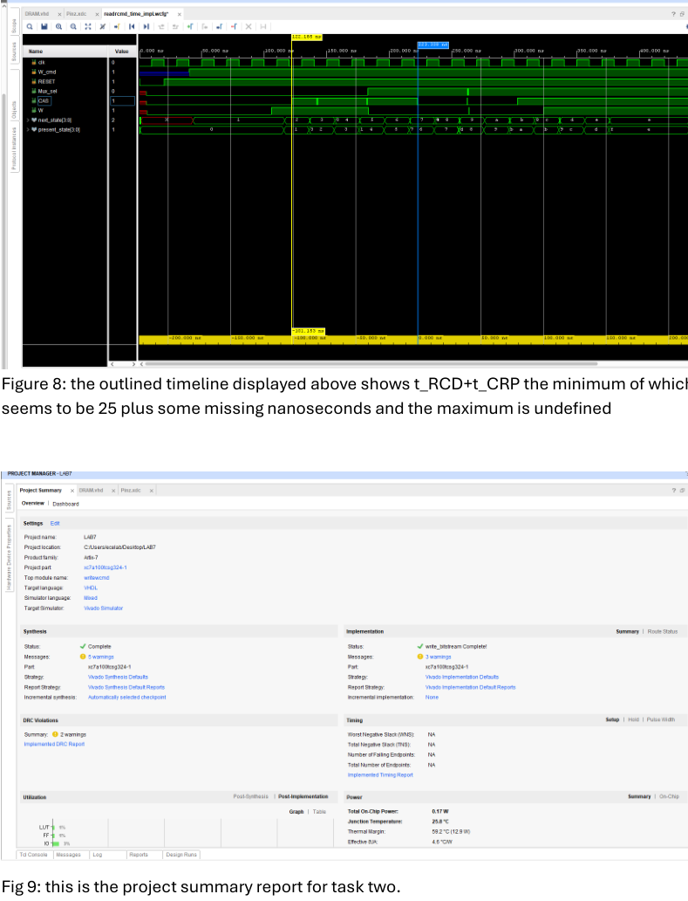
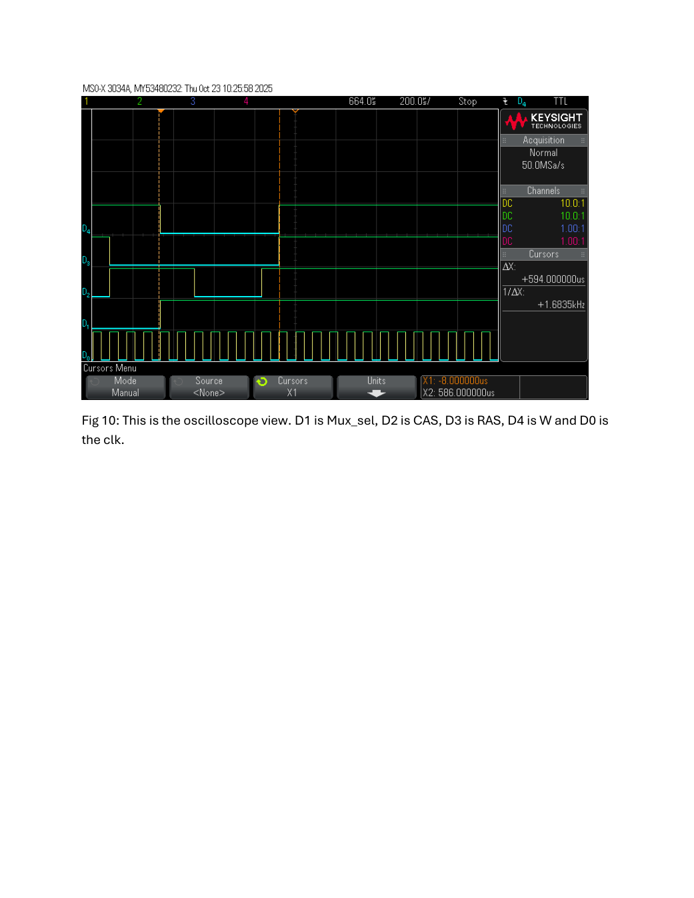
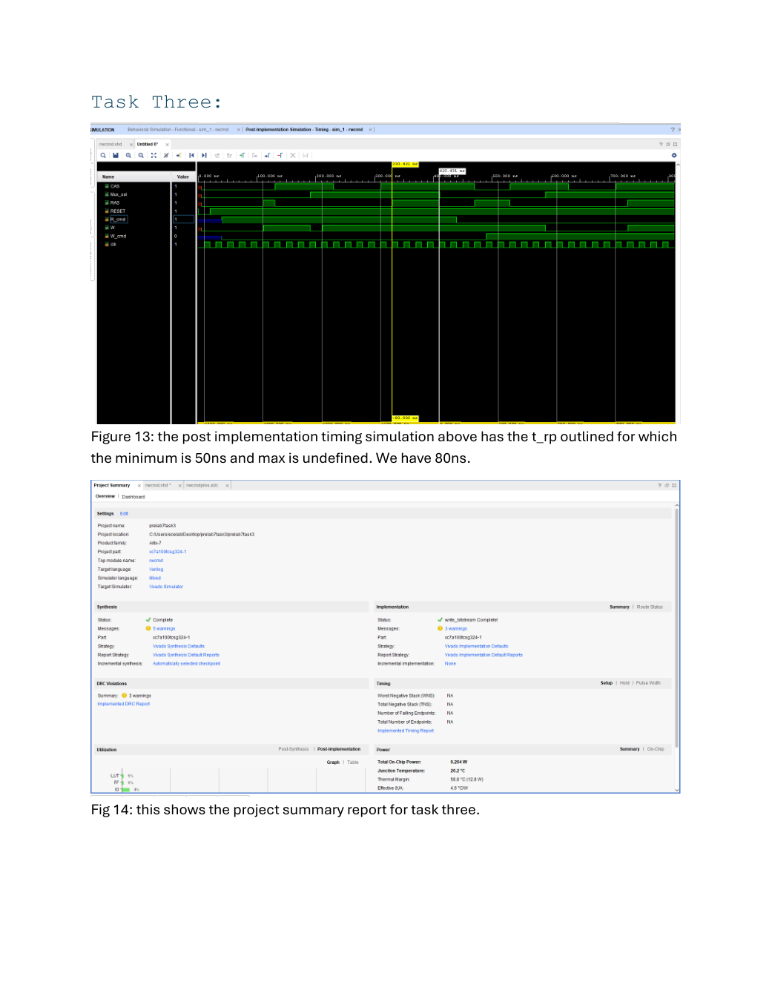
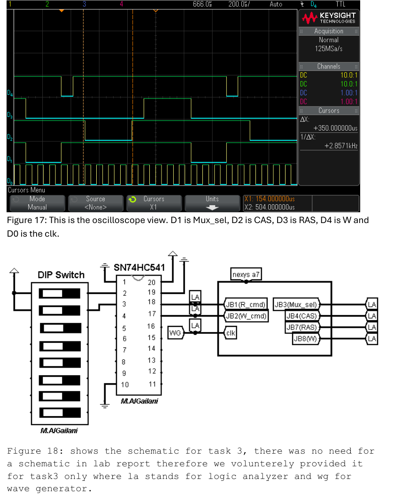

# DRAM Controller (Read / Write / Integrated) in VHDL

This lab was all about **driving a DRAM the “real” way**: generating **RAS/CAS/W** control signals with the right sequencing *and* meeting the chip’s **AC timing specs**.

We built:
- **Task 1:** a DRAM **read cycle** controller
- **Task 2:** a DRAM **write cycle** controller
- **Task 3:** a single controller that **does both read + write** depending on commands

For each task we verified timing two ways:
1) **Post-route timing simulation** (Vivado)  
2) **Oscilloscope capture** (logic analyzer channels / scope cursors)

---

## Repo description (GitHub description box)

**Option A (clean):**  
VHDL DRAM controller on Nexys A7: implemented DRAM read and write cycles (RAS/CAS/W + mux select) with timing verified in post-route simulation and on the oscilloscope, then integrated both operations into one controller.

**Option B (short):**  
DRAM read/write controller FSM in VHDL with post-route + oscilloscope timing verification.

---

## Suggested repo layout

```
.
├─ src/
│  ├─ readrcmd.vhd          # Task 1: read cycle controller
│  ├─ writercmd.vhd         # Task 2: write cycle controller (if you split it)
│  └─ rwcmd.vhd             # Task 3: integrated read+write controller
├─ sim/
│  ├─ task1_forces.tcl
│  ├─ task2_forces.tcl
│  └─ task3_forces.tcl
├─ constraints/
│  ├─ task1.xdc
│  ├─ task2.xdc
│  └─ task3.xdc
├─ assets/
│  ├─ task1_postroute_timing.png
│  ├─ task1_project_summary_and_scope.png
│  ├─ task2_postroute_and_summary.png
│  ├─ task2_scope.png
│  ├─ task3_postroute_and_summary.png
│  └─ task3_scope_and_schematic.png
└─ report/
   └─ ECE 4525 Lab 7 Report.pdf
```

---

## Signals (what the controller drives)

- `RAS` — row address strobe  
- `CAS` — column address strobe  
- `W`   — write enable (depends on the task)  
- `Mux_sel` — selects row vs column address into the DRAM address pins  
- `R_cmd`, `W_cmd` — command inputs telling the controller what cycle to run  
- `RESET`, `clk` — system reset + clock

---

## Task 1 — Read cycle

### Post-route timing + t_RAS check
The post-route waveform shows outputs delayed until ~110 ns and then matching the desired cycle.
The report also highlights an example t_RAS measurement (199.176 ns) within the datasheet limits.



### Project summary + scope view
The scope view uses channels to track `Mux_sel`, `CAS`, `RAS`, `W`, and `clk`.



---

## Task 2 — Write cycle

### Post-route timing + summary
Timing was again checked in post-route sim, and the report calls out an example window for t_RCD + t_CRP.



### Scope view
Scope capture showing the write-cycle sequencing.



---

## Task 3 — Integrated read + write controller

### Post-route timing + summary
The report highlights an example t_RP measurement (80 ns) compared to a 50 ns minimum.



### Scope view + wiring schematic
This page includes an oscilloscope capture and a handy schematic showing how the DIP switch / buffer / Nexys A7 / instruments are connected.



---

## Code snippets (the parts you actually care about)

### 1) FSM pattern (combinational next-state + sequential state register)

```vhdl
type state_t is (idle, s1, s2, s3, s4, s5, s6, s7, s8, s9, s10, s11, s12, s13, s14);
signal present_state, next_state : state_t := idle;

-- Next-state + outputs
process(present_state, R_cmd)
begin
  case present_state is
    when idle =>
      -- default outputs
      if R_cmd = '1' then next_state <= s1;
      else next_state <= idle;
      end if;

    when s1 =>
      -- drive RAS/CAS/W/Mux_sel for this step
      next_state <= s2;

    -- ...
    when others =>
      next_state <= idle;
  end case;
end process;

-- State register
process
begin
  wait until clk'event and clk = '1';
  if RESET = '0' then present_state <= idle;
  else present_state <= next_state;
  end if;
end process;
```

### 2) Simulation forcing (Tcl idea)

```tcl
restart
add_force clk {0 0ns} {1 10ns} -repeat_every 20ns
add_force RESET {0 0ns}
run 20ns
add_force RESET {1 0ns}
run 20ns
add_force R_cmd {1 0ns}
run 300ns
```

### 3) Pin mapping (XDC idea)
In the report, the controller signals are routed to **Pmod JB** so they can be probed:

```tcl
set_property -dict { PACKAGE_PIN D14 IOSTANDARD LVCMOS33 } [get_ports { R_cmd }]
set_property -dict { PACKAGE_PIN G16 IOSTANDARD LVCMOS33 } [get_ports { Mux_sel }]
set_property -dict { PACKAGE_PIN H14 IOSTANDARD LVCMOS33 } [get_ports { CAS }]
set_property -dict { PACKAGE_PIN E16 IOSTANDARD LVCMOS33 } [get_ports { RAS }]
set_property -dict { PACKAGE_PIN F13 IOSTANDARD LVCMOS33 } [get_ports { W }]
```

---

## Run it (Vivado)

1. Create a Vivado project targeting **Nexys A7**.
2. Add the VHDL for the task you’re running.
3. Add the matching `.xdc`.
4. Run:
   - **Post-implementation timing simulation** to verify delays
   - Hardware programming + oscilloscope capture to validate the real signals

---

## Report

See `report/ECE 4525 Lab 7 Report.pdf` for the full write-up, timing notes, and appendix code.
